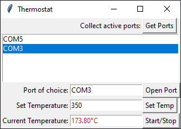

# Thermostat

Simple thermostat using commands over serial data.

## Requirements

1. Python 3
1. PySerial
1. Tkinter

## Usage

```
python app.py
```

## API

Default UART config is 9600 bps, 8 data bits, no parity, one stop bit.

Used serial commands:

```
F=1 - Fan ON
F=0 - Fan OFF
H=1 - Heater ON
H=0 - Heater OFF
T=? - Temperature query
```

Commands are expected to be terminated by sequence `\r\n` (new line).

There is no confirmation of receiving command except for `T=?`, when device
returns value between 0 and 1023 (temperature map depends on sensor).

## Screenshot

